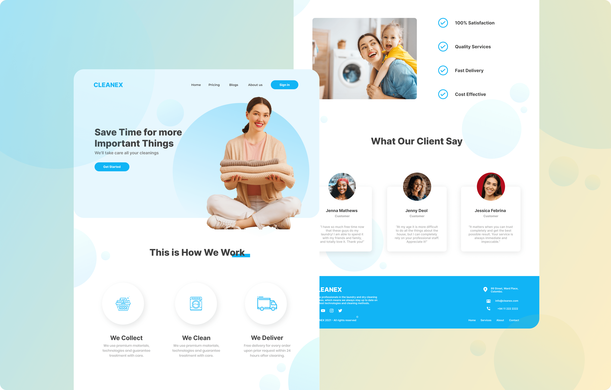

# CLEANEX

Cleanex is a laundry and cleaning company, which provides laundry services to their customers and save customer’s valuable time with allowing
user to make their laundry with a high responsibility. When a customer wants to use Cleanex's services, they must bring their laundry items to
the company premises. Some clothing materials may reject by the company due to the low quality and in that case, the client may have to deal
with certain time-consuming difficulties. As a result, management has come up with a great solution which is a web application that user can
access whenever or wherever they want and check whether the company is able to provide service according to their requirements. For the
convenience of the customer, management decided to introduce a delivery service to collect the laundry item from the customer and again deliver
the item to the customer's doorstep when the laundry service is completed.

#### NOTE❗: This project is developed just for assignment purposes.
